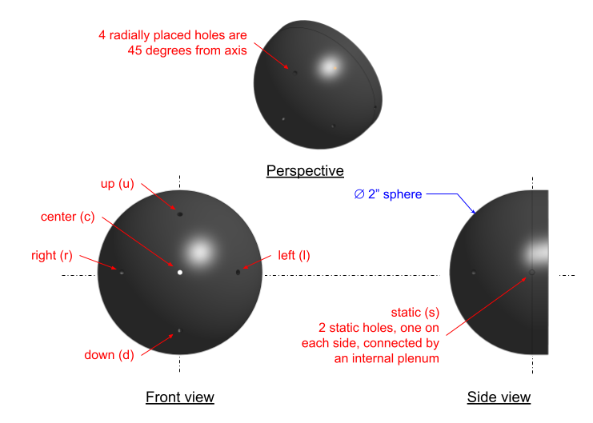
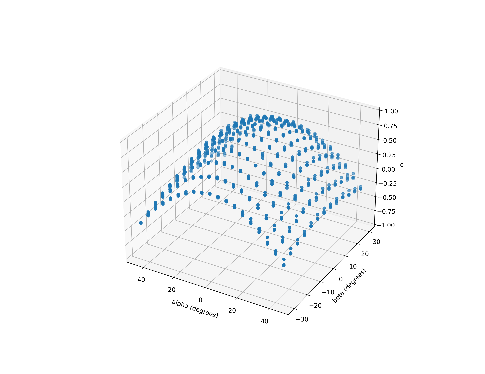
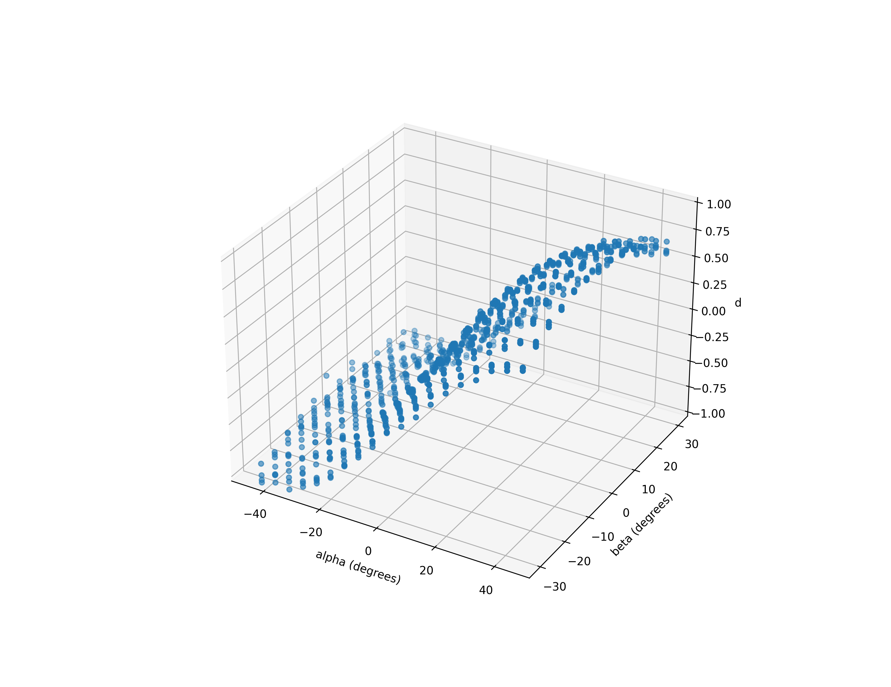
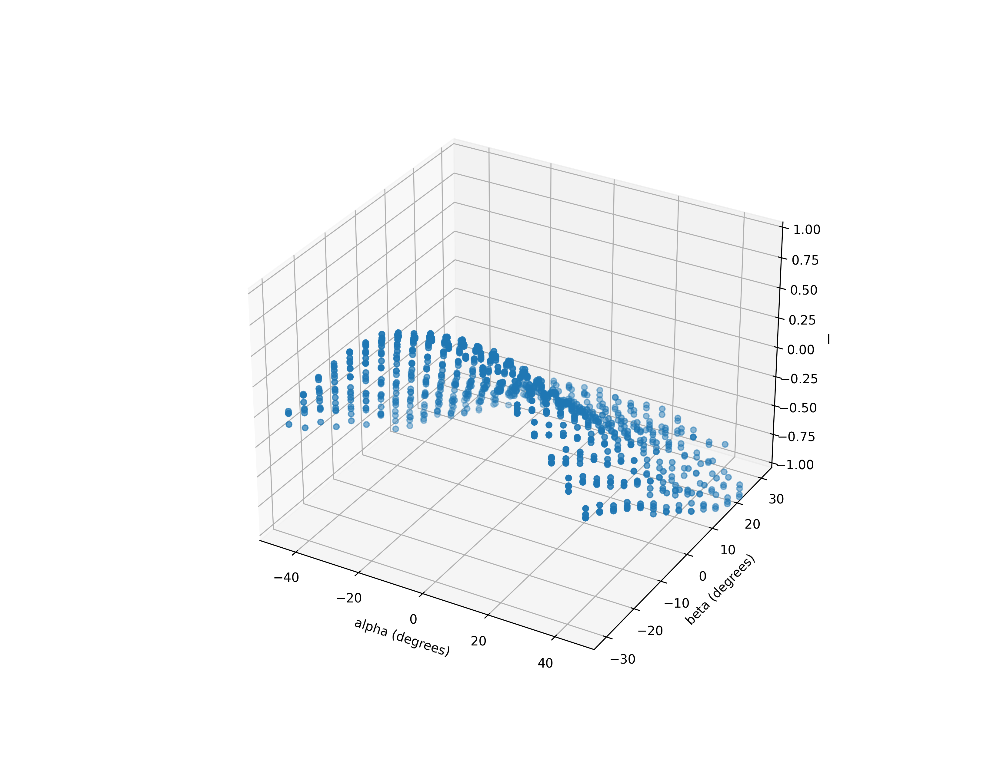
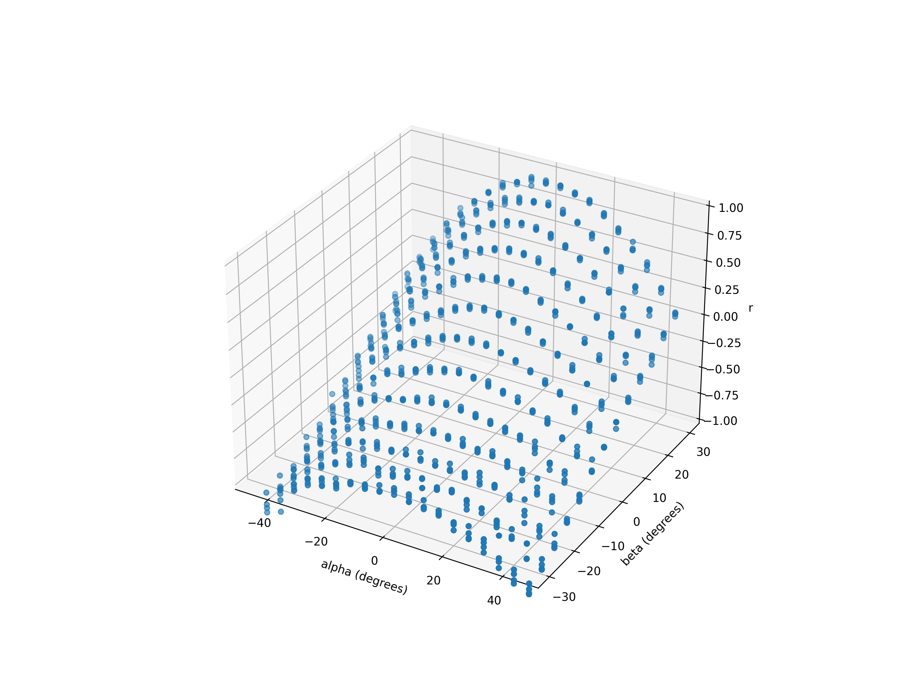
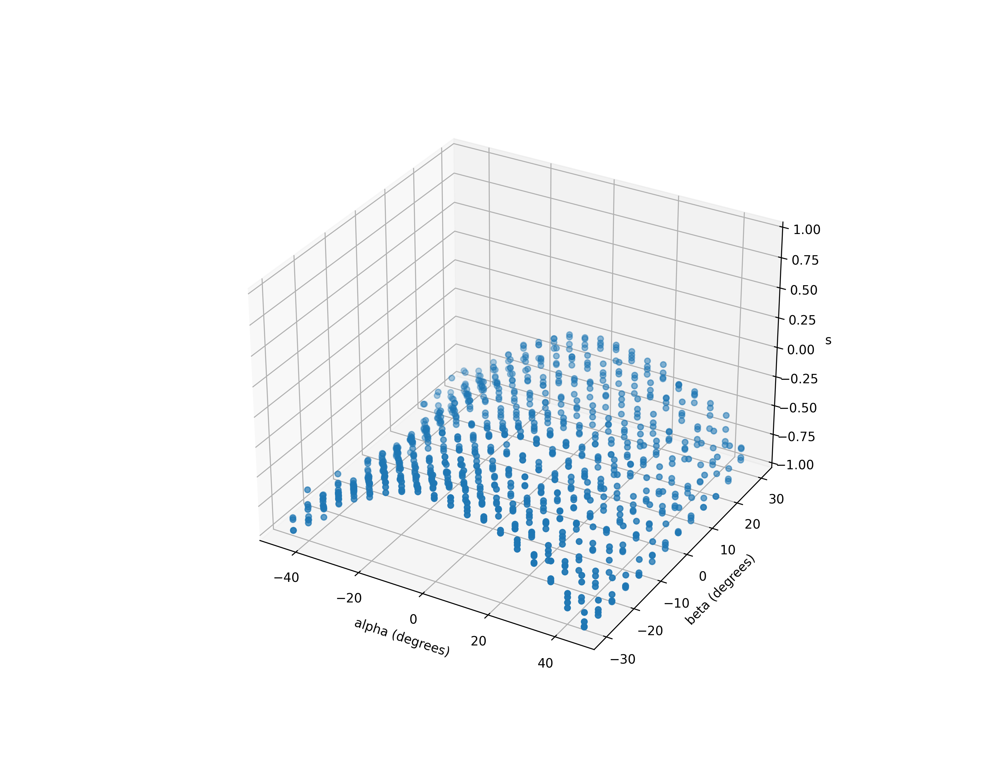

# Description of probe calibration

## Probe design

The probe is a semi-spherial body with 7 holes in it, as follows.

## Experiment design

We installed the above probe in a wind tunnel and acquired data at varying dynamic pressures, for a range of angles of sideslip and attack from -45 to +45 degrees. We plotted the pressure at each hole, divided by _q_, versus _alpha_ and _beta_. These normalized pressures (pressure divided by _q_) are _pressure coefficients_. For the two static holes _s_, we measured and plotted the pressure at the plenum that connects them.

<a href="calibration_plots/alpha_beta_to_pressures_c.png">
  </img>
</a>
<a href="calibration_plots/alpha_beta_to_pressures_d.png">
  </img>
</a>
<a href="calibration_plots/alpha_beta_to_pressures_l.png">
  </img>
</a>
<a href="calibration_plots/alpha_beta_to_pressures_r.png">
  </img>
</a>
<a href="calibration_plots/alpha_beta_to_pressures_s.png">
  </img>
</a>
<a href="calibration_plots/alpha_beta_to_pressures_u.png">
  </img>
</a>

## Measurement strategy

For the operational probe, we _measure_ the following three pressure differences as our means of calculating _alpha_, _beta_, and _q_:

* dp0 = (Pc - Ps)
* dpA = (Pd - Pu)
* dpB = (Pr - Pl)

These are actual measurements in units of pressure. If we take the ratios, we now get non-dimensional values:

* (dpA / dp0)
* (dpB / dp0)

We can use these non-dimensional ratios as indices into calibration curves, and estimate _alpha_, _beta_, and _q_.

Notice how we do not need a source of static pressure since we _subtract_ pressures from one another, and we do not need an independent source of _q_ since we _divide_ pressures by one another. We can measure the absolute value of _s_ with a barometer, and compute a correction that recovers the true static pressure.